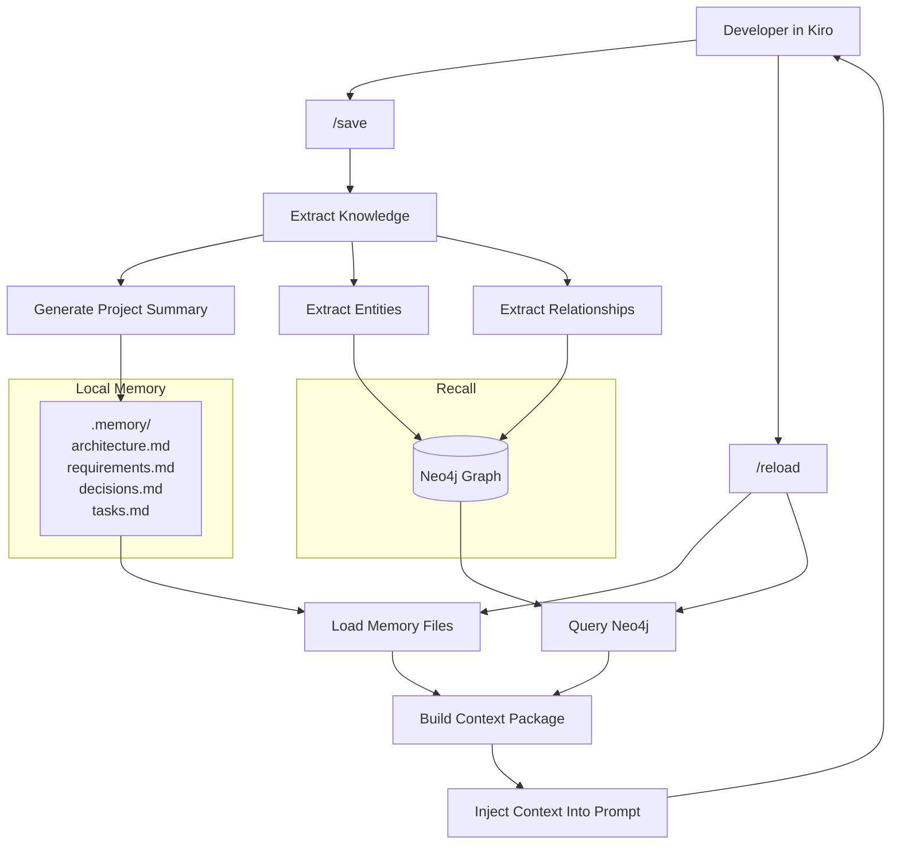
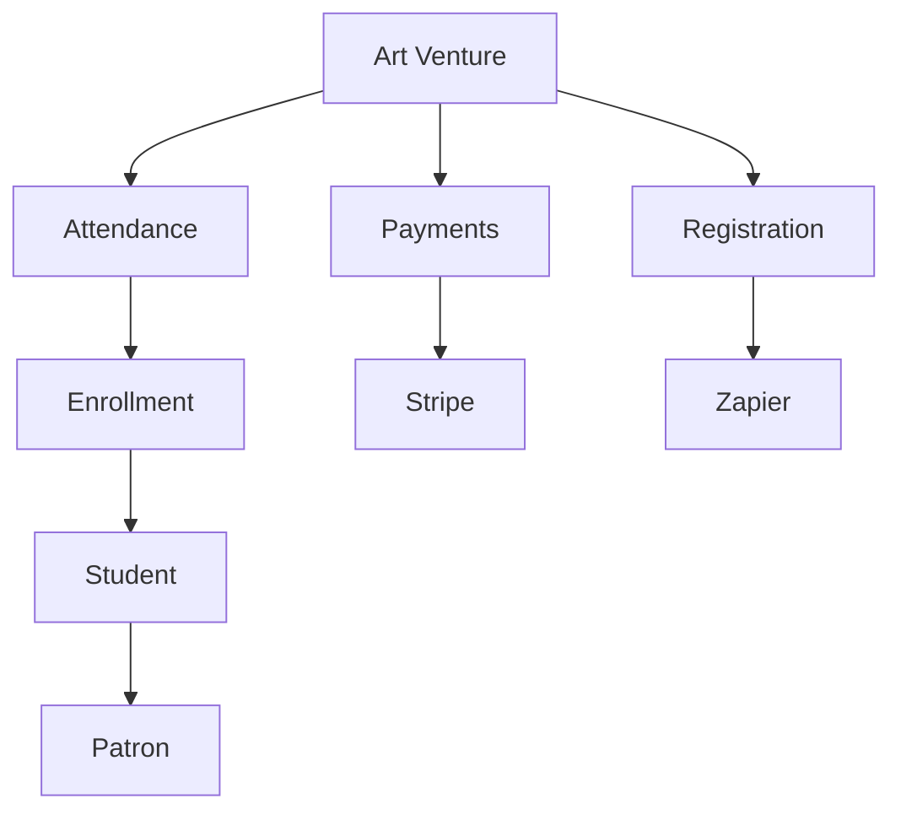

# Recall

**Persistent AI Memory for Kiro**

Recall is a local-first memory system that extends Kiro with long-term project knowledge. It combines structured graph storage (Neo4j) with human-readable markdown memory files to preserve architecture decisions, requirements, relationships, and project context across sessions.

---

## Overview

Large AI coding sessions eventually hit context limits. While Kiro's save/reload workflow is effective, valuable project knowledge can become fragmented across conversations.

Recall solves this by storing durable project knowledge in a graph database and generating concise context packages that can be reloaded into future sessions.

### Goals

- Reduce context window usage
- Persist project knowledge across sessions
- Preserve architecture decisions
- Track feature dependencies
- Support save/reload workflows
- Run entirely locally
- Minimize token consumption
- Remain simple and maintainable

---

## Architecture



---

## Features

### Save Workflow

Extracts durable project knowledge from the current session.

Stores:

- Project summary
- Requirements
- Architecture
- Open tasks
- Decisions
- Entities
- Relationships

Updates:

- Markdown memory files
- Neo4j knowledge graph

---

### Reload Workflow

Builds a compact context package from:

- Project memory files
- Neo4j graph relationships

Injects only relevant information into Kiro.

Benefits:

- Smaller prompts
- Lower token usage
- Better project continuity

---

### Knowledge Graph

Recall stores relationships between project entities.

Examples:

```text
Attendance DEPENDS_ON Enrollment

Enrollment REFERENCES Student

Student BELONGS_TO Patron

Payments USES Stripe

Registration INTEGRATES_WITH Zapier
```

This enables relationship-aware retrieval that traditional markdown files cannot provide.

---

## Project Structure

```text
recall/

├── docker-compose.yml

├── .memory/
│   ├── architecture.md
│   ├── requirements.md
│   ├── decisions.md
│   ├── tasks.md
│   ├── entities.md
│   └── project-summary.md

├── src/
│   ├── save/
│   ├── reload/
│   ├── graph/
│   ├── prompts/
│   └── retrieval/

├── neo4j/

└── README.md
```

---

## Technology Stack

### Core

- Kiro
- Neo4j
- Docker

### Future Enhancements

- Qdrant
- Chroma
- Bedrock Embeddings
- OpenAI Embeddings

---

## Getting Started

### Prerequisites

- Docker
- Docker Compose
- Kiro

---

### Start Neo4j

```bash
docker compose up -d
```

Access Neo4j:

```text
http://localhost:7474
```

Default credentials:

```text
username: neo4j
password: password
```

---

## Docker Configuration

```yaml
version: "3.9"

services:
  neo4j:
    image: neo4j:5

    container_name: neo4j-memory

    restart: unless-stopped

    ports:
      - "7474:7474"
      - "7687:7687"

    environment:
      NEO4J_AUTH: neo4j/password

    volumes:
      - neo4j_data:/data

volumes:
  neo4j_data:
```

---

## Save Command

Example:

```text
/save
```

Expected output:

```text
✓ Project Summary Updated
✓ Architecture Updated
✓ Requirements Updated
✓ Tasks Updated
✓ Neo4j Memory Updated
```

---

## Reload Command

Example:

```text
/reload
```

Expected output:

```text
Loading project memory...

✓ Architecture Loaded
✓ Requirements Loaded
✓ Open Tasks Loaded
✓ Related Features Loaded

Context package generated.
```

---

## Memory Files

### architecture.md

Stores:

- System architecture
- Major components
- Integrations
- Infrastructure

---

### requirements.md

Stores:

- Business rules
- Functional requirements
- Constraints

---

### decisions.md

Stores:

- Technical decisions
- Tradeoffs
- Design rationale

---

### tasks.md

Stores:

- Active work
- Pending items
- Known issues

---

## Graph Model

### Nodes

```text
Project
Feature
Task
Decision
Requirement
API
DatabaseTable
Component
```

### Relationships

```text
DEPENDS_ON
USES
IMPLEMENTS
REFERENCES
BLOCKED_BY
IMPACTS
INTEGRATES_WITH
```

---

## Example Graph



---

## Token Optimization

### Traditional Workflow

```text
Full Chat History

15,000–25,000 tokens
```

### Recall Workflow

```text
Project Memory Files

+
Graph Retrieval

=
500–2,000 tokens
```

Potential reduction:

```text
70–90%
```

depending on project size.

---

## Development Roadmap

### Phase 1

- Dockerized Neo4j
- Markdown memory
- Save workflow
- Reload workflow

### Phase 2

- Graph retrieval engine
- Relationship querying
- Context ranking

### Phase 3

- Vector search
- Semantic retrieval
- Automated memory updates

### Phase 4

- Multi-project support
- Team memory sharing
- Cross-project relationships

---

## Success Metrics

- Context reload under 2,000 tokens
- Less than 5 minutes weekly maintenance
- Architecture decisions preserved
- Reduced context loss
- Faster project onboarding
- Lower Kiro token consumption

---

## License

MIT

---

## Philosophy

Store knowledge, not conversations.

Recall focuses on preserving durable project intelligence rather than replaying chat history. The goal is to give Kiro access to the information that matters while keeping prompts concise, relevant, and cost-effective.

## Run Neo4j

```bash
docker compose up -d
```

