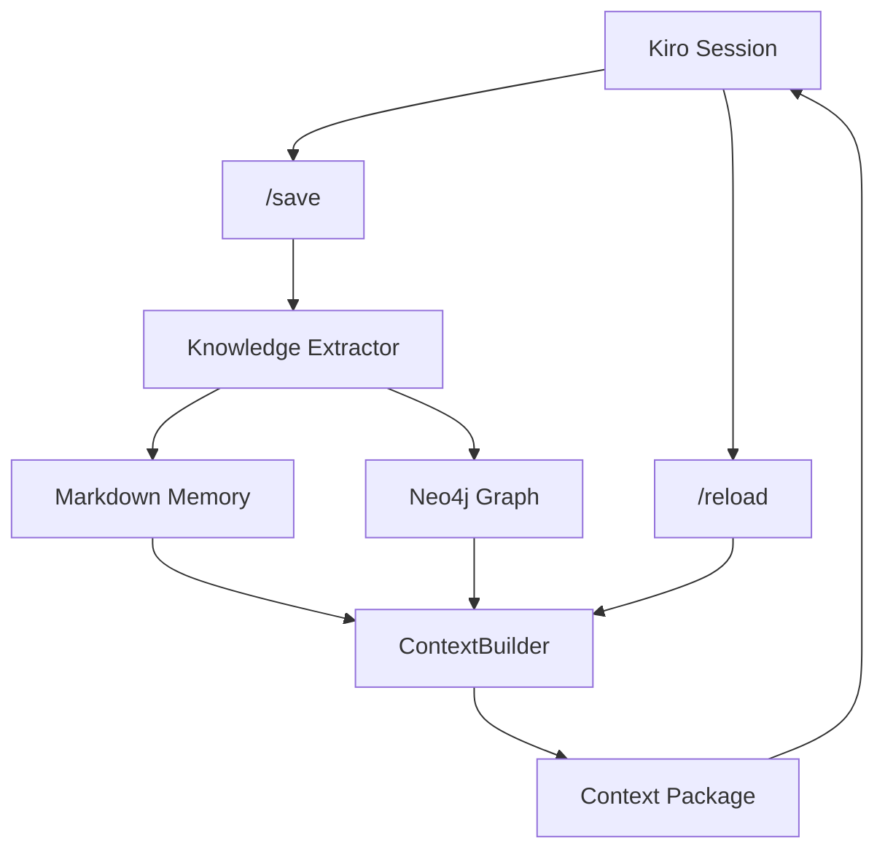
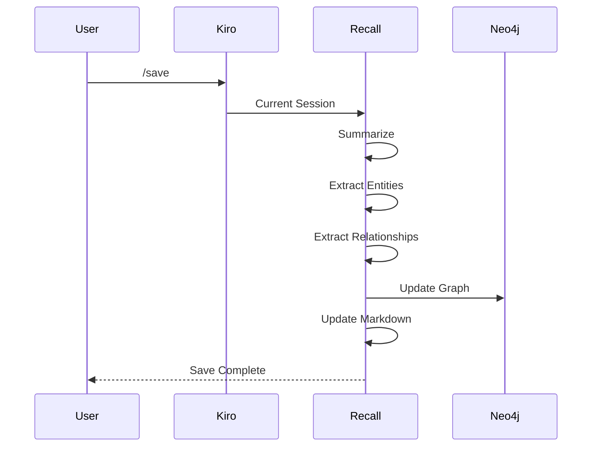
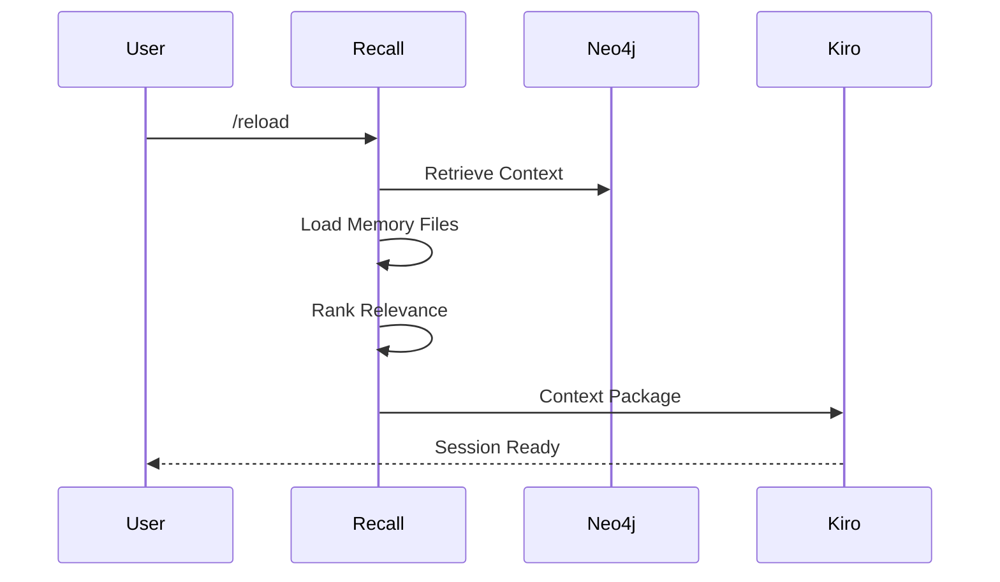

# Recall Design Document

## Overview

Recall is a local-first memory system designed to extend Kiro with persistent project knowledge. It enables long-running software projects to maintain context across sessions while minimizing token consumption.

Unlike chat history replay, Recall stores durable knowledge such as architecture decisions, requirements, entities, relationships, and project state. This knowledge can then be selectively retrieved and injected into future Kiro sessions.

The primary objective is to preserve project intelligence while keeping context windows small and manageable.

---

# Problem Statement

Modern AI-assisted development workflows face several challenges:

* Context windows eventually become full.
* Important architectural decisions become buried in conversations.
* Requirements drift across sessions.
* Developers repeatedly explain project structure.
* Token consumption grows as projects mature.

Current save/reload workflows mitigate these issues but require manually curating project state.

Recall introduces structured memory that can be queried and reused automatically.

---

# Design Goals

## Primary Goals

* Persistent project memory
* Local-first deployment
* Minimal operational cost
* Low token overhead
* Human-readable storage
* Relationship-aware retrieval
* Support for multiple projects

## Non-Goals

* Replacing source control
* Storing entire conversations
* Real-time collaborative editing
* Full project documentation generation
* Autonomous project management

---

# High-Level Architecture



---

# System Components

## Knowledge Extractor

Responsible for transforming conversation state into durable memory.

Inputs:

* Current Kiro session
* Existing memory

Outputs:

* Markdown summaries
* Graph entities
* Graph relationships

Responsibilities:

* Summarization
* Entity extraction
* Relationship extraction
* Deduplication

---

## Markdown Memory Store

Human-readable project memory.

Purpose:

* Easy inspection
* Version control
* Recovery mechanism
* Offline reference

Structure:

```text
.memory/

architecture.md
requirements.md
decisions.md
tasks.md
project-summary.md
entities.md
```

---

## Neo4j Graph Store

Stores structured project knowledge.

Purpose:

* Relationship discovery
* Dependency tracking
* Context retrieval
* Knowledge exploration

Example:

```text
Attendance
    DEPENDS_ON
Enrollment

Enrollment
    REFERENCES
Student

Student
    BELONGS_TO
Patron
```

---

## Context Builder

Constructs optimized context packages.

Responsibilities:

* Read markdown memory
* Query graph
* Rank relevance
* Generate prompt package

Target size:

```text
500-2000 tokens
```

---

# Memory Model

## Memory Categories

### Project Summary

High-level project description.

Example:

```text
Art Venture Student Portal

Supports:
- Registration
- Attendance
- Stripe Payments
- Class Scheduling
```

---

### Requirements

Business requirements and constraints.

Example:

```text
Adult students receive four bonus classes per month.
```

---

### Architecture

System structure and integrations.

Example:

```text
Frontend: Next.js

Database: Supabase

Payments: Stripe

Automation: Zapier
```

---

### Decisions

Technical decisions and rationale.

Example:

```text
Decision:
Use Stripe Checkout

Reason:
Simplify PCI compliance.
```

---

### Tasks

Current project work.

Example:

```text
Switch payment form to production.
```

---

# Graph Data Model

## Node Types

### Project

```json
{
  "type": "Project",
  "name": "Art Venture"
}
```

### Feature

```json
{
  "type": "Feature",
  "name": "Attendance"
}
```

### Requirement

```json
{
  "type": "Requirement",
  "name": "Bonus Classes"
}
```

### Decision

```json
{
  "type": "Decision",
  "name": "Use Stripe Checkout"
}
```

### Component

```json
{
  "type": "Component",
  "name": "Student Portal"
}
```

### Table

```json
{
  "type": "DatabaseTable",
  "name": "students"
}
```

---

## Relationship Types

### DEPENDS_ON

```text
Attendance DEPENDS_ON Enrollment
```

### USES

```text
Payments USES Stripe
```

### REFERENCES

```text
Enrollment REFERENCES Student
```

### IMPLEMENTS

```text
Attendance IMPLEMENTS Bonus Classes
```

### IMPACTS

```text
Stripe Checkout IMPACTS Payments
```

### BLOCKED_BY

```text
Production Release BLOCKED_BY Testing
```

---

# Save Workflow

## Sequence



---

# Reload Workflow

## Sequence



---

# Token Strategy

## Current Workflow

Typical project:

```text
Architecture
Requirements
Tasks
Recent History
```

Often exceeds:

```text
10,000+ tokens
```

---

## Recall Workflow

Reload package:

```text
Project Summary

Relevant Requirements

Relevant Decisions

Open Tasks

Graph Relationships
```

Target:

```text
500-2,000 tokens
```

Expected reduction:

```text
70-90%
```

---

# Future Enhancements

## Phase 2

Semantic Search

Add:

* Qdrant
* Chroma

Store:

* Research
* Documentation
* Meeting Notes

---

## Phase 3

Automated Graph Updates

Triggers:

* Save operations
* Pull requests
* Releases

---

## Phase 4

Cross-Project Intelligence

Example:

```text
Project A uses Stripe

Project B uses Stripe

Decision:
Standardize payment implementation
```

---

# Risks

## Memory Pollution

Risk:

Low-value information enters memory.

Mitigation:

Only store durable knowledge.

---

## Graph Bloat

Risk:

Graph grows indefinitely.

Mitigation:

Deduplication and periodic cleanup.

---

## Retrieval Quality

Risk:

Irrelevant context returned.

Mitigation:

Relevance ranking and memory categorization.

---

# Success Criteria

The system is considered successful when:

* Project reload remains under 2,000 tokens
* Context continuity is preserved across sessions
* Architecture decisions are recoverable
* Feature dependencies can be queried
* Token consumption decreases significantly
* Memory maintenance requires minimal effort

---

# Design Principle

Store knowledge, not conversations.

Recall should preserve information that remains useful weeks or months later while discarding transient discussion details. The objective is to maximize context quality while minimizing context size.

